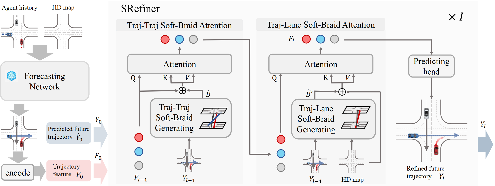
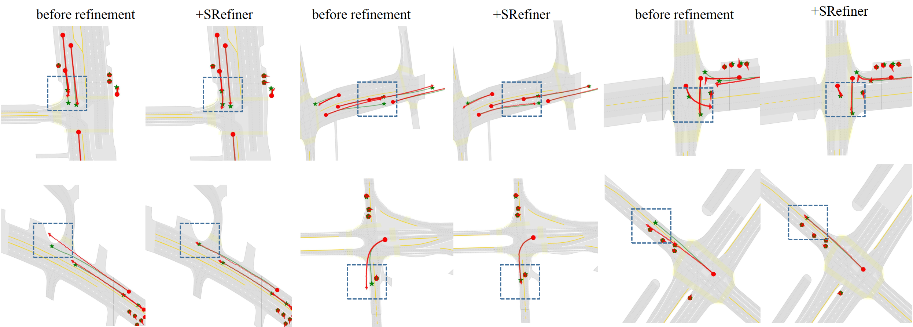

# ***SRefiner: Soft-Braid Attention for Multi-Agent Trajectory Refinement***

<div>
<div align="center">
    <a href='https://scholar.google.com/citations?hl=zh-CN&user=moZlanQAAAAJ' target='_blank'>Liwen Xiao</a><sup>1</sup>&emsp;
    <a href='https://scholar.google.com/citations?user=X1AP9ZEAAAAJ&hl=zh-CN' target='_blank'>Zhiyu Pan</a><sup>1</sup>&emsp;   
    <a href='https://scholar.google.com/citations?user=d6qLT28AAAAJ&hl=zh-CN' target='_blank'>Zhicheng Wang</a><sup>1</sup>&emsp;       
    <a href='https://scholar.google.com/citations?user=396o2BAAAAAJ&hl=zh-CN' target='_blank'>Zhiguo Cao</a><sup>1</sup>&emsp;
    <a href='https://scholar.google.com/citations?user=41KAd6AAAAAJ&hl=zh-CN' target='_blank'>Wei Li</a><sup>2,†</sup>&emsp;<br>
</div>
<div align="center">
    <sup>1</sup>Huazhong University of Science and Technology&emsp;
    <sup>2</sup>Nanyang Technological University&emsp;
</div>
<div align="center">
<sup>†</sup>Corresponding Authors
</div>

## 🌟 Abstract
Accurate prediction of multi-agent future trajectories is crucial for autonomous driving systems to make safe and efficient decisions. Trajectory refinement has emerged as a key strategy to enhance prediction accuracy. However, existing refinement methods often overlook the topological relationships between trajectories, which are vital for improving prediction precision. Inspired by braid theory, we propose a novel trajectory refinement approach, Soft-Braid Refiner (SRefiner), guided by the soft-braid topological structure of trajectories using Soft-Braid Attention. Soft-Braid Attention captures spatio-temporal topological relationships between trajectories by considering both spatial proximity and vehicle motion states at “soft intersection points”. Additionally, we extend this approach to model interactions between trajectories and lanes, further improving the prediction accuracy. SRefiner is a multi-iteration, multi-agent framework that iteratively refines trajectories, incorporating topological information to enhance interactions within traffic scenarios. SRefiner achieves significant performance improvements over four baseline methods across two datasets, establishing a new state-of-the-art in trajectory refinement. 



Paper Link: [paper](https://openaccess.thecvf.com/content/ICCV2025/papers/Xiao_SRefiner_Soft-Braid_Attention_for_Multi-Agent_Trajectory_Refinement_ICCV_2025_paper.pdf)

## 🚀 Qualitative Results
* On Argoverse v2 motion forecasting dataset (multi-agent track)


## 💻 Getting Started
### Install dependencies
* Create a new conda virtual env
  ```bash
  conda create --name srefiner python=3.8
  conda activate srefiner
  ```
* Install PyTorch according to your CUDA version. We recommend CUDA >= 11.1, PyTorch >= 1.8.0.
  ```bash
  conda install pytorch==1.12.0 torchvision==0.13.0 torchaudio==0.12.0 cudatoolkit=11.6 -c pytorch -c conda-forge
  ```
* Install Argoverse 1 & 2 APIs, please follow [argoverse-api](https://github.com/argoai/argoverse-api) and [av2-api](https://argoverse.github.io/user-guide/getting_started.html).
* Install other dependencies
  ```bash
  pip install scikit-image IPython tqdm ipdb tensorboard
  ```

### Play with pretrained models
Download the dataset(Dataset: Argiverse v2; Baseline: Forecast-MAE): [dataset](https://openxlab.org.cn/datasets/Leonnn/SRefiner-FMAE)

Due to limitations imposed by the cloud storage platform, each compressed archive must not exceed 4GB in size. We have split the training set into multiple subsets. Please decompress all subsets and organize the files as follows:
  ```
  SRefiner/
  ├── data_av2_refine/
  │      ├──p1_fmae_av2_final/
  │      │     ├── train/
  │      │     │     ├── scene_0001.pkl
  │      │     │     ├── scene_0002.pkl
  │      │     │     └── ...
  │      │     └── val/
  │      │           ├── scene_1001.pkl
  │      │           └── ...
  ```
Evaluate on the pretrained model
  ```bash
  cd SRefiner
  bash av2_script/fmae-av2-refine-multiagent_eval_ddp.sh
  ```

### Have a train
  ```bash
  cd SRefiner
  bash av2_script/fmae-av2-refine-multiagent-train_ddp.sh
  ```

## 📚 Citation
If you find our work useful for your research, please consider citing our paper:

```
@inproceedings{xiao2025srefiner,
  title={SRefiner: Soft-Braid Attention for Multi-Agent Trajectory Refinement},
  author={Xiao, Liwen and Pan, Zhiyu and Wang, Zhicheng and Cao, Zhiguo and Li, Wei},
  booktitle={Proceedings of the IEEE/CVF International Conference on Computer Vision},
  pages={960--969},
  year={2025}
}
```


## ♥️ Acknowledgement
We would like to express sincere thanks to the authors of the following packages and tools:
* [SIMPL](https://github.com/HKUST-Aerial-Robotics/SIMPL)
* [HiVT](https://github.com/ZikangZhou/HiVT)
* [SmartRefine](https://github.com/opendilab/SmartRefine)

## 📎 License
This repository is licensed under [MIT license](https://github.com/Liwen-Xiao/SRefiner/blob/main/LICENSE).
